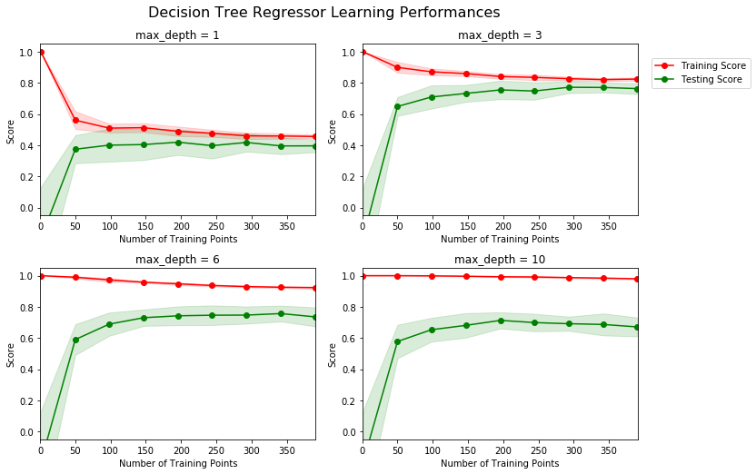

# Project: Predicting Boston Housing Prices
*Model Evaluation and Validation*

## Summary
### Main
- [boston_housing.ipynb](boston_housing.ipynb) ([html](others/boston_housing.html))

### Content
- Explore Data
  -  Calculate statistics
  -  Observe features
- Preprocess data
  - Shuffle and split data
- Analyze model performance
  - Metric:  coefficient of determination ( `sklearn.metrics.r2_score` )
  - Evaluate the decision tree model with varying maximum depths
    
  - Select the optimal paramaters using  grid search (GridSearchCV)
  - Train the optimized model
    
  - Evaluate performance
    - Training Score =  0.7806
    - Testing Score = 0.6849

## [Project Description](others/project_description.md)
### Install
This project requires **Python** and the following Python libraries installed:

- [NumPy](http://www.numpy.org/)
- [Pandas](http://pandas.pydata.org/)
- [matplotlib](http://matplotlib.org/)
- [scikit-learn](http://scikit-learn.org/stable/)

You will also need to have software installed to run and execute a [Jupyter Notebook](http://ipython.org/notebook.html)

### Run
In a terminal or command window, navigate to the top-level project directory (that contains this README) and run the following commands. This will open the Jupyter Notebook and project file in your browser.
```bash
jupyter notebook boston_housing.ipynb
```

### Data
The modified Boston housing dataset consists of 489 data points, with each datapoint having 3 features. This dataset is a modified version of the Boston Housing dataset found on the [UCI Machine Learning Repository](https://archive.ics.uci.edu/ml/datasets/Housing).

**Features**
1.  `RM`: average number of rooms per dwelling
2. `LSTAT`: percentage of population considered lower status
3. `PTRATIO`: pupil-teacher ratio by town

**Target Variable**
4. `MEDV`: median value of owner-occupied homes

