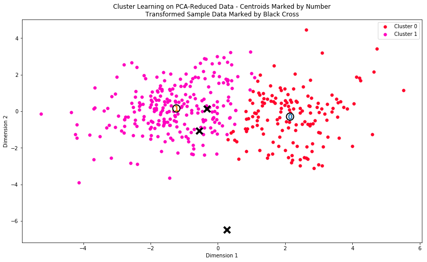
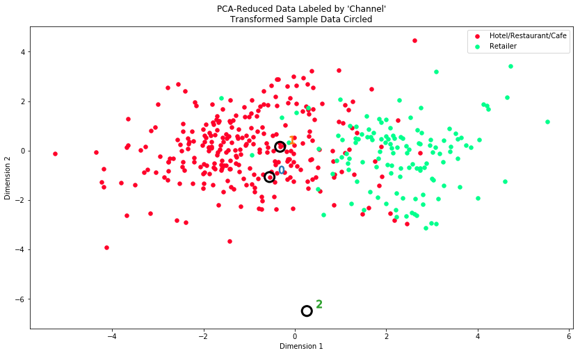

# Project: Creating Customer Segments
*Unsupervised Learning*

## Summary
### Main
- [customer_segments.ipynb](customer_segments.ipynb)([html](others/customer_segments.html))

### Content

- Explore data 
  - Visualize and observe feature relevance 
    - 
- Preprocess data
  - Scale skewed continuous features
  - Detect and clear outliers
- Transform features
  - Apply principal component analysis (PCA) 
    - 
  - Dimensionality reduction using PCA
  - Visualize a biplot
    - 
- Cluster
  - Metric: silhouette coefficient ( `sklearn.metrics.silhouette_score` )

  - Evaluate the  Guassian mixture model(GMM) with varying number of clusters
    - Number of clusters = 2, score = 0.4474
    - Number of clusters = 3, score = 0.3612
    - Number of clusters = 4, score = 0.3040

  - Train the optimized GMM

  - Visualize clusters

    - 

  - Evaluate performance with original underlying distributions

    - 


## [Project Information](others/project_description.md)
### Install
This project requires **Python 2.7** and the following Python libraries installed:

- [NumPy](http://www.numpy.org/)
- [Pandas](http://pandas.pydata.org)
- [matplotlib](http://matplotlib.org/)
- [scikit-learn](http://scikit-learn.org/stable/)

You will also need to have software installed to run and execute a [Jupyter Notebook](http://ipython.org/notebook.html)

### Run
In a terminal or command window, navigate to the top-level project  directory (that contains this README) and run the following commands.  This will open the Jupyter Notebook and project file in your browser. 
```bash
ipython notebook customer_segments.ipynb
```

## Data
The customer segments data is included as a selection of 440 data points collected on data found from clients of a wholesale distributor in Lisbon, Portugal. More information can be found on the [UCI Machine Learning Repository](https://archive.ics.uci.edu/ml/datasets/Wholesale+customers).

Note (m.u.) is shorthand for *monetary units*.

**Features**
1) `Fresh`: annual spending (m.u.) on fresh products (Continuous); 
2) `Milk`: annual spending (m.u.) on milk products (Continuous); 
3) `Grocery`: annual spending (m.u.) on grocery products (Continuous); 
4) `Frozen`: annual spending (m.u.) on frozen products (Continuous);
5) `Detergents_Paper`: annual spending (m.u.) on detergents and paper products (Continuous);
6) `Delicatessen`: annual spending (m.u.) on and delicatessen products (Continuous); 
7) `Channel`: {Hotel/Restaurant/Cafe - 1, Retail - 2} (Nominal)
8) `Region`: {Lisbon - 1, Oporto - 2, or Other - 3} (Nominal) 