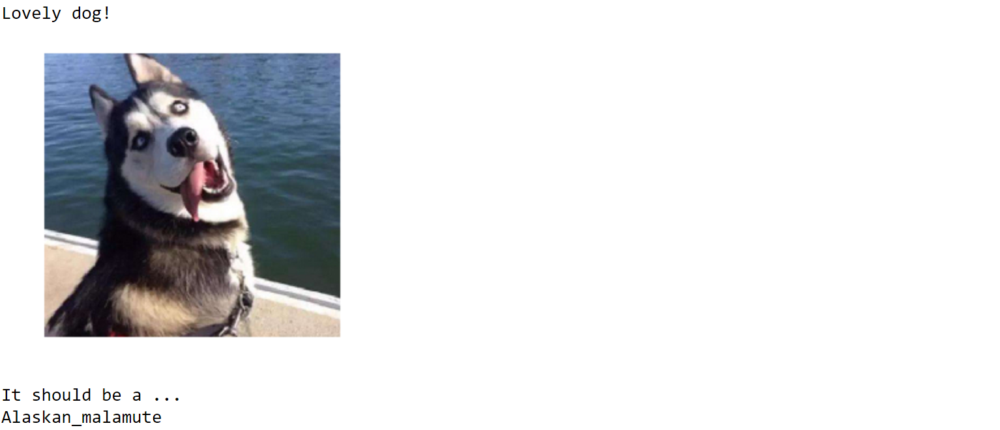
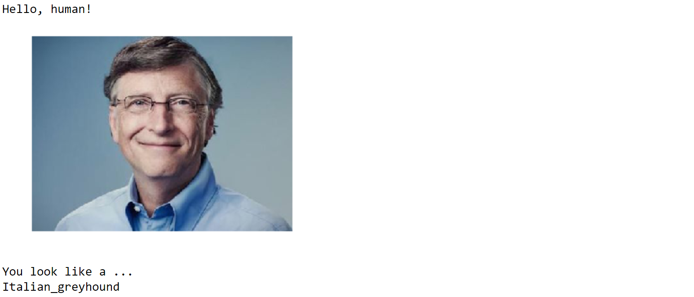
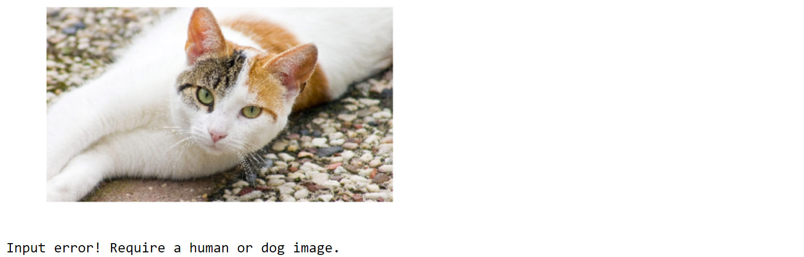

## Project: Dog Breed Recognition

*Deep Learning*

## Summary
### Main
- [dog_app.ipynb](dog_app.ipynb) ([html](dog_app.html))

### Content
- Detect humans face using OpenCV

- Detect dogs using ResNet-50

- Classify dog breads
  - CNN
    - Test accuracy: 2.1531%
  - CNN using transfer learning (VGG-16)
    - Test accuracy: 47.6077%
  - CNN using transfer learning (VGG-19)
    - Test accuracy: 85.2488%
- Build app
  - **Dog**
    > 
  - **Human**
    > 
  - **Others**
    > 

  

## [Project Description](others/project_description.md)
### Install
This project requires Python and the following Python libraries installed:

- NumPy
- Pandas
- matplotlib
- scikit-learn
- TensorFlow
- Keras
- OpenCV
- tqdm

You will also need to have software installed to run and execute an iPython Notebook

### Data
1. Clone the repository and navigate to the downloaded folder.
2. Download the [dog dataset](https://s3-us-west-1.amazonaws.com/udacity-aind/dog-project/dogImages.zip).  Unzip the folder and place it at location `dogImages/`. 
3. Download the [human dataset](https://s3-us-west-1.amazonaws.com/udacity-aind/dog-project/lfw.zip).  Unzip the folder and place it at location `lfw/`. 
4. Download the [VGG-16 bottleneck features](https://s3-us-west-1.amazonaws.com/udacity-aind/dog-project/DogVGG16Data.npz) for the dog dataset.  Place it at location `bottleneck_features/`.

### Run
In a terminal or command window, navigate to the top-level project   directory (that contains this README) and run the following commands.   This will open the Jupyter Notebook and project file in your browser.
```
jupyter notebook dog_app.ipynb
```
