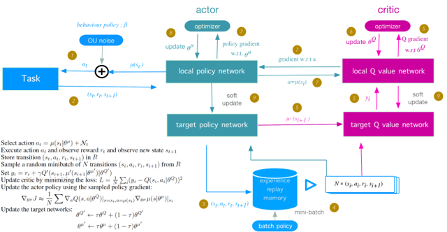
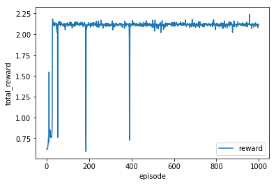

## Project: Teach a Quadcopter to Take Off

*Deep Reinforce Learning*

## Summary
### Main
- [agent.py](agents/agent.py)
- [task.py](task.py)
- [Quadcopter_Project.ipynb](Quadcopter_Project.ipynb) ([html](Quadcopter_Project.html))

### Content
- Build a deep deterministic policy gradients (DDPG) model in [agent.py](agents/agent.py)
  > 
- Set a task environment and the reward function in [task.py](task.py)

- Train in [Quadcopter_Project.ipynb](Quadcopter_Project.ipynb) ([html](Quadcopter_Project.html))

  > 

## [Project Description](others/project_description.md)
### Code

- [task.py](task.py): Taking off task
- [agents](agents)
  - [policy_search.py](policy_search.py): A sample agent using stochastic policy
  - [agent.py](agent.py): DDPG model
- [physics_sim.py](physics_sim.py): Quadcopter simulator

### Install

This project requires Python and the following Python libraries installed:

- NumPy
- Pandas
- matplotlib
- tqdm
- TensorFlow
- Keras

You will also need to have software installed to run and execute a Jupyter Notebook

### Run
In a terminal or command window, navigate to the top-level project directory (that contains this README) and run the following commands. This will open the Jupyter Notebook and project file in your browser.
```
jupyter notebook Quadcopter_Project.ipynb
```
