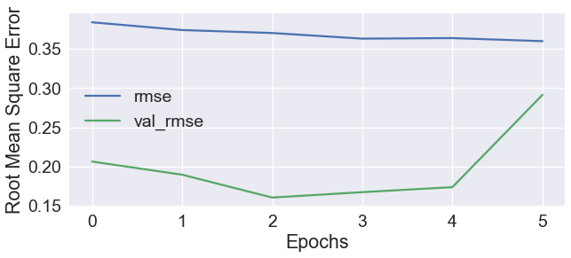
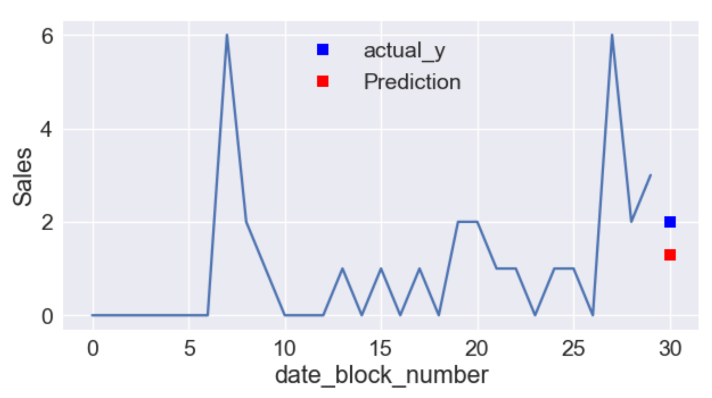

# [Predict Future Sales](https://www.kaggle.com/c/competitive-data-science-predict-future-sales)
*Kaggle competition*
[My Profile on Kaggle](https://www.kaggle.com/aperture830)
## Summary
### Main
- [predict_sales.ipynb](predict_sales.ipynb) ([html](predict_sales.html))
- [Report.pdf](Report.pdf)

### Content
- Explore Data
  - Calculate statistics
  - Observe features
- Preprocess data
  - Detect and clear outliers
  - Reshape data frame
  - Normalization
  - Expand data
- Predict future sales
  - Build a LSTM model
  - Set early stop of validation loss
  - Train the optimized model

    > 
  - Test
    > Even though the sales increases on block 29, the model correctly predicts than it will decrease on block 30.
    > 
  - Predict and write to csv
    - Date: 06/27/2018
    - Score: 1.01885 
    - Rank: 179 of  817

## [Project Description](others/project_description.md)
### Install
This project requires **Python** and the following Python libraries installed:

- NumPy
- Pandas
- tqdm
- seaborn
- matplotlib
- TensorFlow
- Keras

You will also need to have software installed to run and execute a [Jupyter Notebook](http://ipython.org/notebook.html)

### Run
In a terminal or command window, navigate to the top-level project directory (that contains this README) and run the following commands. This will open the Jupyter Notebook and project file in your browser.
```bash
jupyter notebook predict_sales.ipynb
```

### Data
You are provided with daily historical sales data. The task is to forecast the total amount of products sold in every shop for the test set. Note that the list of shops and products slightly changes every month. Creating a robust model that can handle such situations is part of the challenge.
File descriptions

- `sales_train.csv` the training set. Daily historical data from January 2013 to October 2015.
- `shops.csv`supplemental information about the shops.
- `items.csv` supplemental information about the items/products.
- `item_categories.csv`  supplemental information about the items categories.
- `test.csv` the test set. You need to forecast the sales for these shops and products for November 2015.
- `sample_submission.csv` a sample submission file in the correct format.

Data fields
- `ID` an Id that represents a (Shop, Item) tuple within the test set
